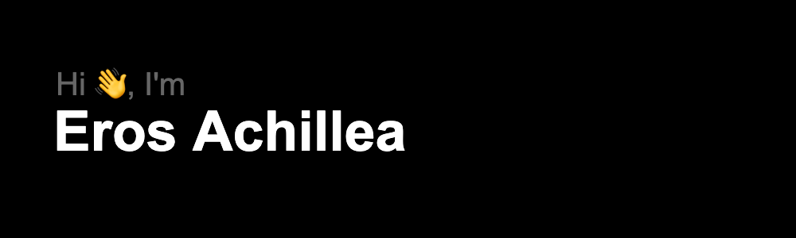

   

<h1 align='center'> Welcome to my github profile! </h1>

  
  &nbsp;&nbsp;
  

<h2> :man_technologist: About me</h2>

- :telescope: I have recently completed a data engineering graduate program with Sigma Labs and looking for my first role as a data engineer.

- :seedling: Planning to explore more technologies like spark, databricks and snowflake.

- :zap: Im naturally a curious person, so in my free time, I like to learn new things by completing online courses and virtual experiences.

- 🎸 My hobbies include: playing the guitar, boxing, reading and going to the gym.

- :mailbox: How to reach me: 

<h2> :hammer_and_wrench: Languages and Tools </h2>

<h2> 🎓 Education </h2>

<h2> 📁 Experience </h2>

<h2> 👷 Data engineering projects </h2>
<!--
**Eros-code/Eros-code** is a ✨ _special_ ✨ repository because its `README.md` (this file) appears on your GitHub profile.

Here are some ideas to get you started:

- 🔭 I’m currently working on ...
- 🌱 I’m currently learning ...
- 👯 I’m looking to collaborate on ...
- 🤔 I’m looking for help with ...
- 💬 Ask me about ...
- 📫 How to reach me: ...
- 😄 Pronouns: ...
- ⚡ Fun fact: ...
-->
